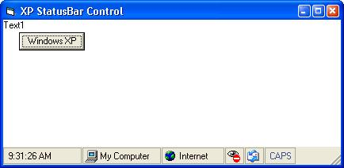



## xpWellsStatusbar 2

### Description

Added the Office Xp look to Richard Wells' Statusbar.

Also added AutoSize to the panels.

Here is the link to Richards Pevious submition

http://www.Planet-Source-Code.com/vb/scripts/ShowCode.asp?txtCodeId=44379&lngWId=1

The statusbar more closely resembles Visual Studio Dotnet's statusbar than Office XP's.
 
### More Info
 

             |
---                |---
**Submitted On**   |2003-05-26 17:28:28
**By**             |[Mick\-S](https://github.com/Planet-Source-Code/PSCIndex/blob/master/ByAuthor/mick-s.md)
**Level**          |Intermediate
**User Rating**    |5.0 (35 globes from 7 users)
**Compatibility**  |VB 6\.0
**Category**       |[Custom Controls/ Forms/  Menus](https://github.com/Planet-Source-Code/PSCIndex/blob/master/ByCategory/custom-controls-forms-menus__1-4.md)
**World**          |[Visual Basic](https://github.com/Planet-Source-Code/PSCIndex/blob/master/ByWorld/visual-basic.md)
**Archive File**   |[xpWellsSta1592755262003\.zip](https://github.com/Planet-Source-Code/mick-s-xpwellsstatusbar-2__1-45721/archive/master.zip)

